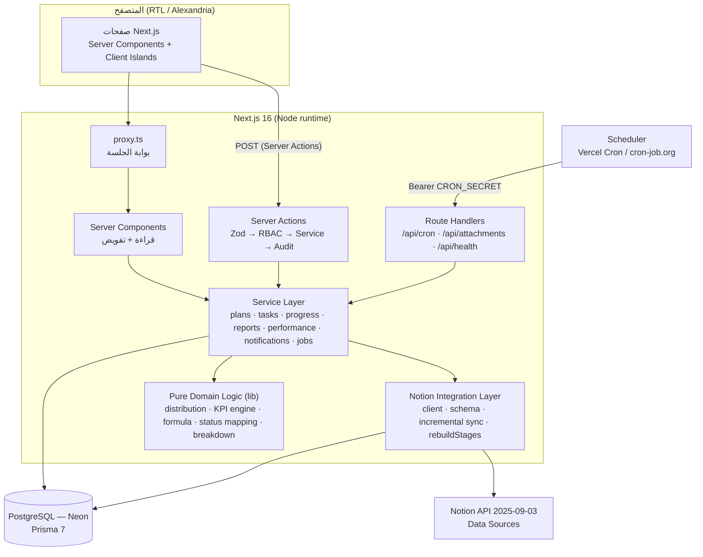
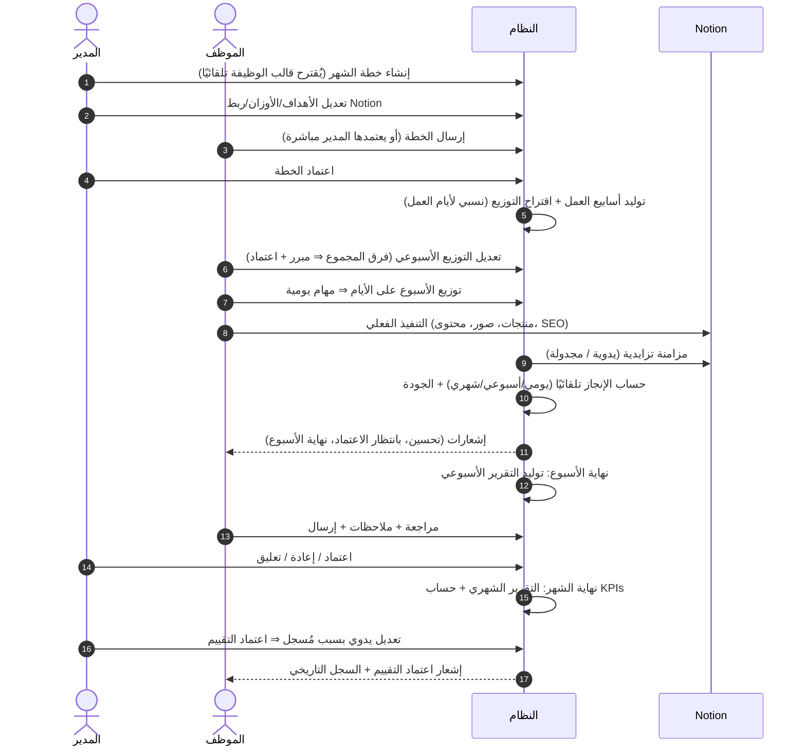
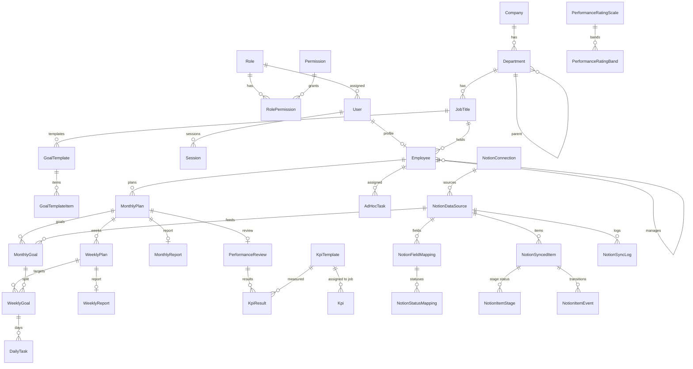
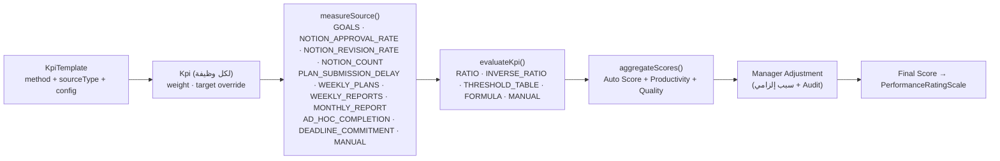

# معمارية النظام — مركز الإدارة والتقييم

> نظام داخلي يحوّل مسار العمل الحالي (OneNote + Notion + Excel) إلى Workflow واحد مؤتمت:
> **الأهداف الشهرية ← الخطط الأسبوعية ← المهام اليومية ← التنفيذ في Notion ← سحب الإنجاز تلقائيًا ← التقارير ← KPIs ← التقييم ← السجل التاريخي**

---

## 1. System Architecture



**مبادئ التصميم**

| المبدأ | التطبيق |
|---|---|
| لا إدخال مكرر | الأهداف المرتبطة بـ Notion تُحسب من العناصر المتزامنة؛ الموظف يضيف ملاحظة/سبب تأخير فقط |
| لا منطق مرتبط بأسماء Notion | كل الحقول والحالات عبر `NotionFieldMapping` و`NotionStatusMapping` قابلة للتعديل من اللوحة |
| منطق نقي قابل للاختبار | التوزيع، محرك KPI، المعادلات، ربط الحالات، حساب الإنجاز — كلها دوال نقية في `src/lib` مع اختبارات |
| تفويض على الخادم دائمًا | كل صفحة/Action/Route يتحقق من الجلسة والصلاحية ونطاق الموظف |
| قرار الإنسان محفوظ | إعادة الحساب لا تلغي تعديلات المدير اليدوية؛ كل تعديل حساس في `AuditLog` |

## 2. User Roles (RBAC)

الصلاحيات مفاتيح في جدول `Permission` مرتبطة بالأدوار عبر `RolePermission` — قابلة للتعديل من `/settings/permissions`. القرارات في الكود تعتمد على **المفتاح** لا اسم الدور.

| الصلاحية | System Admin | Store Manager | Employee |
|---|:-:|:-:|:-:|
| `system.admin` (تشمل الكل) | ✔ | | |
| إدارة المستخدمين/الأدوار/الهيكل | ✔ | | |
| إعداد Notion + تشغيل المزامنة | ✔ | ✔ | |
| قوالب الأهداف، مؤشرات الأداء، سلم التقييم | ✔ | قوالب ✔ | |
| إنشاء واعتماد الخطط | ✔ | ✔ | |
| توزيع أهدافي على الأسابيع/الأيام | ✔ | ✔ | ✔ |
| تكليف مهام مستجدة | ✔ | ✔ | |
| مراجعة واعتماد التقارير | ✔ | ✔ | |
| إرسال تقاريري | ✔ | | ✔ |
| إعداد/اعتماد التقييم | ✔ | ✔ | |
| عرض تقييمي وسجلي | ✔ | ✔ | ✔ |
| سجل التدقيق | ✔ | ✔ | |

**نطاق البيانات:** `employees.view_all` ← كل الموظفين؛ غير ذلك ← نفسه + تابعيه المباشرين (`Employee.managerId`).

## 3. User Flow



## 4. Database ERD (مختصر)



## 5. Prisma Schema

المصدر الكامل: [`prisma/schema.prisma`](../prisma/schema.prisma) (40 جدولًا، 30+ فهرسًا). أهم قرارات التصميم:

- **`@db.Date` للأيام** مع التعامل كنص `YYYY-MM-DD` ⇒ لا انزياح بسبب المنطقة الزمنية (Asia/Riyadh).
- **`NotionItemStage`** صف لكل (عنصر × مرحلة عمل) بالحالة الحالية ⇒ تجميع SQL سريع دون تحليل JSON.
- **`NotionItemEvent`** سجل انتقالات الحالة ⇒ حساب "إعادة العمل" (Rework) حتى لو اعتُمد العنصر لاحقًا.
- **`breakdown` JSON** مخزن على الهدف/الهدف الأسبوعي/المهمة ⇒ الصفحات لا تعيد الحساب في كل طلب.
- **`KpiResult`** يحفظ لقطة كاملة (الاسم، الهدف، الوزن، التفاصيل) ⇒ السجل التاريخي لا يتغير بتغيير إعدادات المؤشر لاحقًا.
- **`Attachment.data` (bytea)** حتى 5MB ⇒ يعمل على أي استضافة دون خدمة ملفات خارجية.
- **`RateLimit`** في Postgres ⇒ يعمل عبر نسخ Serverless المتعددة.

## 6. Notion Integration Architecture

```mermaid
flowchart LR
  A["NotionConnection<br/>token مشفر AES-256-GCM"] --> B["dataSources.query<br/>filter: last_edited_time ≥ cursor − 2min<br/>sort: ascending, 100/page"]
  B --> C["normalizeProperties<br/>(title, select, multi_select, status, date, people …)"]
  C --> D["mapNotionItem<br/>FieldMapping: TITLE/BATCH/CODE/DATE/EMPLOYEE"]
  D --> E["resolveSystemStatus<br/>StatusMapping + precedence"]
  E --> F[("NotionSyncedItem<br/>NotionItemStage<br/>NotionItemEvent")]
  F --> G["computeBreakdown(rule, period)"]
  G --> H["MonthlyGoal / WeeklyGoal / DailyTask<br/>achieved · progress · quality"]
```



- **Incremental Sync:** يُحفظ `syncCursor` (أقصى `last_edited_time`)، وتُجلب فقط الصفحات المعدلة بعده مع هامش دقيقتين (Notion يقرّب الوقت للدقيقة). الترتيب تصاعدي ⇒ يمكن التوقف الآمن بعد 45 ثانية (حد الـ Serverless) واستكمال الباقي في التشغيل التالي.
- **تخطي غير المتغير:** إذا كان `lastEditedTime` المخزن ≥ الوارد ⇒ `recordsSkipped`.
- **Full Resync:** يعيد معالجة الكل ويعلّم الصفحات المحذوفة من Notion كمؤرشفة.
- **Sync Logs:** كل تشغيل ⇒ `NotionSyncLog` (البداية/النهاية/الممسوح/المُنشأ/المُحدث/الأخطاء/النطاق) + زر **Retry**.
- **تعديل الربط لا يحتاج Notion:** `rebuildStages` يعيد اشتقاق الحالات من الخصائص المخزنة ثم يعيد حساب الإنجاز.
- **حدود المعدل:** SDK v5 يعيد المحاولة تلقائيًا على 429/5xx مع back-off.
- **الإسناد للموظف:** حقل People/Created-by أو نص مطابق لـ `notionUserId`/`notionAlias`، أو "الموظف الافتراضي" للقاعدة، أو **مسؤول المرحلة** (`ownerEmployeeId`) — مناسب لقاعدة المنتجات الحالية التي لا تحتوي حقل "المسؤول".

**قاعدة الفلترة للهدف (`NotionFilterRule`):**

```json
{
  "stageKey": "store",
  "completedStatuses": ["COMPLETED"],
  "completedRawValues": ["تم الإضافة", "مضاف نهائي"],
  "conditions": [{ "field": "batch", "op": "eq", "value": 65 }],
  "dateBasis": "STAGE_CHANGED",
  "matchEmployee": false
}
```

الناتج لكل فترة (شهر/أسبوع/يوم): `Target, Worked, Completed, Pending Approval, Needs Revision, Blocked, Remaining, Rework, Approval Rate, Revision Rate`.

**ربط افتراضي جاهز** لقاعدة "قاعدة بيانات إضافة المنتجات للمتجر" (زر "تطبيق الربط المقترح"): مراحل `images`, `productImage`, `approval`, `store`, `content`, `description`, `seo`, `seoInitial`, `imageUpload` بقيمها الفعلية الموجودة في Notion.

## 7. KPI Calculation Architecture



- **Achievement Rate** = Achieved ÷ Target × 100 (بسقف قابل للتعديل)؛ **Weighted Score** = Rate × Weight.
- **Auto Score** = Σ(Rate × Weight) ÷ ΣWeight ⇒ صحيح حتى لو لم تكن الأوزان 100.
- **فصل الإنتاجية عن الجودة:** 110 عنصر (70 معتمد / 40 للتحسين) لا يتفوق تلقائيًا على 100 عنصر (95 / 5)، لأن مؤشرات الجودة (نسبة الاعتماد، نسبة إعادة العمل) منفصلة وموزونة — مثبت باختبار.
- **THRESHOLD_TABLE** مثال "التسليم في الموعد": 0 يوم=5، 1=4، 2=3، 3=2، 4+=1.
- **FORMULA:** لغة تعبيرات آمنة (Parser مخصص، لا `eval`) بمتغيرات `achieved, target, worked, completed, needsRevision, pendingApproval, reworkCount, daysLate, count, total` ودوال `min, max, round, abs, floor, ceil, clamp, if`.
- **سلم التقييم** من `PerformanceRatingBand` (غير ثابت في الكود)، والاختيار = أعلى حد أدنى ≤ النتيجة (يتعامل مع الكسور مثل 94.5).

## 8. Folder Structure

```
prisma/                schema.prisma · migrations · seed.ts
src/
  proxy.ts             بوابة الجلسة (Next 16)
  app/(auth)/login     تسجيل الدخول
  app/(app)/…          الصفحات المحمية (Sidebar + Header)
  app/print/…          صفحات الطباعة / PDF
  app/api/…            cron · attachments · health
  actions/             Server Actions لكل مجال
  server/              auth · services · notion · queries · audit · crypto · rate-limit
  lib/                 منطق نقي مشترك (dates, distribution, kpi, notion, validation, labels)
  components/          ui (shadcn) · shared · charts · layout
  features/            مكونات خاصة بكل صفحة
tests/unit             اختبارات المنطق النقي
tests/integration      اختبار المسار الكامل على فرع Neon معزول
docs/                  هذه الوثيقة + CONVENTIONS.md
```

## 9. API Architecture

| النوع | المسار/الملف | الوظيفة | الحماية |
|---|---|---|---|
| Server Actions | `src/actions/plans.ts` | إنشاء/إرسال/اعتماد/إعادة الخطط، الأهداف، التوزيع الأسبوعي واليومي | Session + Permission + Scope + Zod + Audit |
| | `src/actions/tasks.ts` | المهام اليومية، التكليفات المستجدة، تحديث التقدم | 〃 |
| | `src/actions/reports.ts` | توليد/تحديث/ملاحظات/إرسال/مراجعة التقارير | 〃 |
| | `src/actions/performance.ts` | حساب التقييم، تعديل نتيجة مؤشر، تعديل المدير، الاعتماد، إعداد المؤشرات وسلم التقييم | 〃 |
| | `src/actions/notion.ts` | الاتصالات، اكتشاف القواعد، الربط، المزامنة، إعادة المحاولة، اختبار قاعدة الفلترة | 〃 |
| | `src/actions/org.ts` | الشركة، الإدارات، المسميات، الموظفون، الأدوار، القوالب، الإشعارات، كلمة المرور | 〃 |
| REST | `GET/POST /api/cron/run?job=sync\|daily\|all` | المزامنة المجدولة + المهام اليومية (توليد التقارير، التذكيرات، إغلاق الشهر) | `Authorization: Bearer CRON_SECRET` (مقارنة ثابتة الزمن) |
| | `POST /api/attachments`, `GET/DELETE /api/attachments/[id]` | المرفقات | Session + Scope + Origin check |
| | `GET /api/health` | فحص الصحة | عام بدون أسرار |

Server Actions في Next.js محمية من CSRF (POST + فحص Origin مدمج) والكوكي `SameSite=Lax; HttpOnly; Secure`.

## 10. Implementation Roadmap — الحالة

| المرحلة | المحتوى | الحالة |
|---|---|---|
| 1 | Architecture + Schema + Auth + Roles | ✅ |
| 2 | Employees + Departments + Job Titles | ✅ |
| 3 | Monthly Goals + Weekly Plans + Daily Tasks | ✅ |
| 4 | Notion Integration | ✅ (يحتاج رمز التكامل لتفعيله) |
| 5 | Automatic Progress Tracking | ✅ |
| 6 | Weekly Reports | ✅ |
| 7 | Monthly Reports | ✅ |
| 8 | KPI & Performance Evaluation Engine | ✅ |
| 9 | Dashboards + Analytics | ✅ |
| 10 | Notifications + Audit Logs | ✅ (IN_APP؛ واجهة قنوات جاهزة لـ Email/WhatsApp/Slack) |
| 11 | Testing + Security + Performance | ✅ اختبارات وحدات + تكامل، Headers أمنية، Rate limiting، فهارس |

**مقترحات لاحقة:** قناة بريد (SendGrid/Resend) عبر `registerChannel`، webhooks من Notion عند توفرها بدل الاستطلاع، تخزين مرفقات خارجي (S3/Blob) عند تجاوز الأحجام، تقارير Excel للتصدير.
